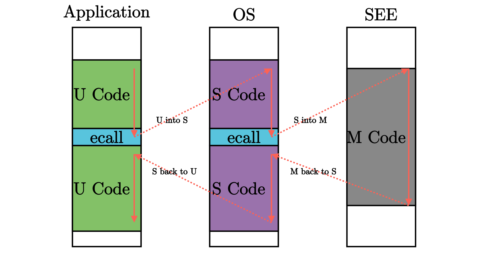

# 第二章
本章系统结构

## 批处理系统
批处理系统 (Batch System) 可用来管理无需或仅需少量用户交互即可运行的程序，在资源允许的情况下它可以自动安排程序的执行，这被称为“批处理作业”，这个名词源自二十世纪60年代的大型机时代。批处理系统的核心思想是：将多个程序打包到一起输入计算机。而当一个程序运行结束后，计算机会 自动 加载下一个程序到内存并开始执行。当软件有了代替操作员的管理和操作能力后，便开始形成真正意义上的操作系统了。

## 特权级机制
应用程序总是难免会出现错误，如果一个程序的执行错误导致其它程序或者整个计算机系统都无法运行就太糟糕了。人们希望一个应用程序的错误不要影响到其它应用程序、操作系统和整个计算机系统。这就需要操作系统能够终止出错的应用程序，转而运行下一个应用程序。这种 保护 计算机系统不受有意或无意出错的程序破坏的机制被称为 特权级 (Privilege) 机制，它让应用程序运行在用户态，而操作系统运行在内核态，且实现用户态和内核态的隔离，这需要计算机软件和硬件的共同努力。  
实现特权级机制的根本原因是应用程序运行的安全性不可充分信任。在上一章里，操作系统以库的形式和应用紧密连接在一起，构成一个整体来执行。随着应用需求的增加，操作系统的体积也越来越大；同时应用自身也会越来越复杂。由于操作系统会被频繁访问，来给多个应用提供服务，所以它可能的错误会比较快地被发现。但应用自身的错误可能就不会很快发现。由于二者通过编译器形成一个单一执行程序来执行，导致即使是应用程序本身的问题，也会让操作系统受到连累，从而可能导致整个计算机系统都不可用了。  
所以，计算机科学家和工程师就想到一个方法，让相对安全可靠的操作系统运行在一个硬件保护的安全执行环境中，不受到应用程序的破坏；而让应用程序运行在另外一个无法破坏操作系统的受限执行环境中。  
为确保操作系统的安全，对应用程序而言，需要限制的主要有两个方面：  
1.应用程序不能访问任意的地址空间  
2.**应用程序不能执行某些可能破坏计算机系统的指令**（本章的重点）  
假设有了这样的限制，我们还需要确保应用程序能够得到操作系统的服务，即应用程序和操作系统还需要有交互的手段。使得低特权级软件只能做高特权级软件允许它做的，且超出低特权级软件能力的功能必须寻求高特权级软件的帮助。这样，高特权级软件（操作系统）就成为低特权级软件（一般应用）的软件执行环境的重要组成部分。

为了实现这样的特权级机制，需要进行软硬件协同设计。一个比较简洁的方法就是，处理器设置两个不同安全等级的执行环境：用户态特权级的执行环境和内核态特权级的执行环境。且明确指出可能破坏计算机系统的内核态特权级指令子集，规定内核态特权级指令子集中的指令只能在内核态特权级的执行环境中执行。处理器在执行指令前会进行特权级安全检查，如果在用户态执行环境中执行这些内核态特权级指令，会产生异常。

为了让应用程序获得操作系统的函数服务，采用传统的函数调用方式（即通常的 call 和 ret 指令或指令组合）将会直接绕过硬件的特权级保护检查。所以可以设计新的机器指令：执行环境调用（Execution Environment Call，简称 ecall ）和执行环境返回(Execution Environment Return，简称 eret )）：

ecall ：具有用户态到内核态的执行环境切换能力的函数调用指令

eret ：具有内核态到用户态的执行环境切换能力的函数返回指令

硬件具有了这样的机制后，还需要操作系统的配合才能最终完成对操作系统自身的保护。首先，操作系统需要提供相应的功能代码，能在执行 eret 前准备和恢复用户态执行应用程序的上下文。其次，在应用程序调用 ecall 指令后，能够检查应用程序的系统调用参数，确保参数不会破坏操作系统。

>执行环境栈   
白色块表示一层执行环境，黑色块表示相邻两层执行环境之间的接口。这张图片给出了能够支持运行 Unix 这类复杂系统的软件栈。其中操作系统内核代码运行在 S 模式上；应用程序运行在 U 模式上。运行在 M 模式上的软件被称为 监督模式执行环境 (SEE, Supervisor Execution Environment)，如在操作系统运行前负责加载操作系统的 Bootloader – RustSBI。站在运行在 S 模式上的软件视角来看，它的下面也需要一层执行环境支撑，因此被命名为 SEE，它需要在相比 S 模式更高的特权级下运行，一般情况下 SEE 在 M 模式上运行。

在后续的章节中，我们会涉及到RISC-V的 M/S/U 三种特权级：其中应用程序和用户态支持库运行在 U 模式的最低特权级；操作系统内核运行在 S 模式特权级（在本章表现为一个简单的批处理系统），形成支撑应用程序和用户态支持库的执行环境；而第一章提到的预编译的 bootloader – RustSBI 实际上是运行在更底层的 M 模式特权级下的软件，是操作系统内核的执行环境。整个软件系统就由这三层运行在不同特权级下的不同软件组成。
## 异常 Exception
执行环境的另一种功能是对上层软件的执行进行监控管理。监控管理可以理解为，当上层软件执行的时候出现了一些异常或特殊情况，导致需要用到执行环境中提供的功能，因此需要暂停上层软件的执行，转而运行执行环境的代码。由于上层软件和执行环境被设计为运行在不同的特权级，这个过程也往往（而 不一定 ）伴随着 CPU 的 特权级切换 。当执行环境的代码运行结束后，我们需要回到上层软件暂停的位置继续执行。在 RISC-V 架构中，这种与常规控制流（顺序、循环、分支、函数调用）不同的 异常控制流 (ECF, Exception Control Flow) 被称为 异常（Exception） ，是 RISC-V 语境下的 Trap 种类之一。

用户态应用直接触发从用户态到内核态的异常的原因总体上可以分为两种：其一是用户态软件为获得内核态操作系统的服务功能而执行特殊指令；其二是在执行某条指令期间产生了错误（如执行了用户态不允许执行的指令或者其他错误）并被 CPU 检测到。

在这样的架构之下，每层特权级的软件都只能做高特权级软件允许它做的、且不会产生什么撼动高特权级软件的事情，一旦低特权级软件的要求超出了其能力范围，就必须寻求高特权级软件的帮助，否则就是一种异常行为了。因此，在软件（应用、操作系统等）执行过程中我们经常能够看到特权级切换。如下图所示：

其他的异常则一般是在执行某一条指令的时候发生了某种错误（如除零、无效地址访问、无效指令等），或处理器认为处于当前特权级下执行的当前指令是高特权级指令或会访问不应该访问的高特权级的资源（可能危害系统）。碰到这些情况，就需要将控制转交给高特权级的软件（如操作系统）来处理。当错误/异常恢复后，则可重新回到低优先级软件去执行；如果不能恢复错误/异常，那高特权级软件可以杀死和清除低特权级软件，避免破坏整个执行环境。

## RISC-V的特权指令
与特权级无关的一般的指令和通用寄存器 x0 ~ x31 在任何特权级都可以执行。而每个特权级都对应一些特殊指令和 控制状态寄存器 (CSR, Control and Status Register) ，来控制该特权级的某些行为并描述其状态。当然特权指令不仅具有读写 CSR 的指令，还有其他功能的特权指令。

如果处于低特权级状态的处理器执行了高特权级的指令，会产生非法指令错误的异常。这样，位于高特权级的执行环境能够得知低特权级的软件出现了错误，这个错误一般是不可恢复的，此时执行环境会将低特权级的软件终止。这在某种程度上体现了特权级保护机制的作用。

## 实现操作系统前执行应用程序

我们还没有实现操作系统，能提前执行或测试应用程序吗？可以！我们除了一个能模拟一台 RISC-V 64 计算机的全系统模拟器 qemu-system-riscv64 外，还有一个直接支持运行 RISC-V 64 用户程序的半系统模拟器 qemu-riscv64 。不过需要注意的是，如果想让用户态应用程序在 qemu-riscv64 模拟器（实际上是一个 RISC-V 架构下的 Linux 操作系统）上和在我们自己写的 OS 上执行效果一样，需要做到二者的系统调用的接口是一样的（包括系统调用编号，参数约定的具体的寄存器和栈等）。