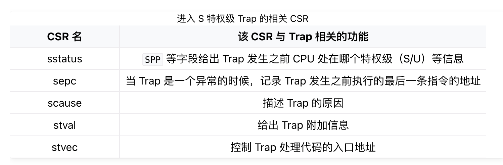

# 第二章
本章系统结构


## 批处理系统
批处理系统 (Batch System) 可用来管理无需或仅需少量用户交互即可运行的程序，在资源允许的情况下它可以自动安排程序的执行，这被称为“批处理作业”，这个名词源自二十世纪60年代的大型机时代。批处理系统的核心思想是：将多个程序打包到一起输入计算机。而当一个程序运行结束后，计算机会 自动 加载下一个程序到内存并开始执行。当软件有了代替操作员的管理和操作能力后，便开始形成真正意义上的操作系统了。


## 特权级机制
应用程序总是难免会出现错误，如果一个程序的执行错误导致其它程序或者整个计算机系统都无法运行就太糟糕了。人们希望一个应用程序的错误不要影响到其它应用程序、操作系统和整个计算机系统。这就需要操作系统能够终止出错的应用程序，转而运行下一个应用程序。这种 保护 计算机系统不受有意或无意出错的程序破坏的机制被称为 特权级 (Privilege) 机制，它让应用程序运行在用户态，而操作系统运行在内核态，且实现用户态和内核态的隔离，这需要计算机软件和硬件的共同努力。  
实现特权级机制的根本原因是应用程序运行的安全性不可充分信任。在上一章里，操作系统以库的形式和应用紧密连接在一起，构成一个整体来执行。随着应用需求的增加，操作系统的体积也越来越大；同时应用自身也会越来越复杂。由于操作系统会被频繁访问，来给多个应用提供服务，所以它可能的错误会比较快地被发现。但应用自身的错误可能就不会很快发现。由于二者通过编译器形成一个单一执行程序来执行，导致即使是应用程序本身的问题，也会让操作系统受到连累，从而可能导致整个计算机系统都不可用了。  
所以，计算机科学家和工程师就想到一个方法，让相对安全可靠的操作系统运行在一个硬件保护的安全执行环境中，不受到应用程序的破坏；而让应用程序运行在另外一个无法破坏操作系统的受限执行环境中。  
为确保操作系统的安全，对应用程序而言，需要限制的主要有两个方面：  
1.应用程序不能访问任意的地址空间  
2.**应用程序不能执行某些可能破坏计算机系统的指令**（本章的重点）  
假设有了这样的限制，我们还需要确保应用程序能够得到操作系统的服务，即应用程序和操作系统还需要有交互的手段。使得低特权级软件只能做高特权级软件允许它做的，且超出低特权级软件能力的功能必须寻求高特权级软件的帮助。这样，高特权级软件（操作系统）就成为低特权级软件（一般应用）的软件执行环境的重要组成部分。

为了实现这样的特权级机制，需要进行软硬件协同设计。一个比较简洁的方法就是，处理器设置两个不同安全等级的执行环境：用户态特权级的执行环境和内核态特权级的执行环境。且明确指出可能破坏计算机系统的内核态特权级指令子集，规定内核态特权级指令子集中的指令只能在内核态特权级的执行环境中执行。处理器在执行指令前会进行特权级安全检查，如果在用户态执行环境中执行这些内核态特权级指令，会产生异常。

为了让应用程序获得操作系统的函数服务，采用传统的函数调用方式（即通常的 call 和 ret 指令或指令组合）将会直接绕过硬件的特权级保护检查。所以可以设计新的机器指令：执行环境调用（Execution Environment Call，简称 ecall ）和执行环境返回(Execution Environment Return，简称 eret )）：

ecall ：具有用户态到内核态的执行环境切换能力的函数调用指令

eret ：具有内核态到用户态的执行环境切换能力的函数返回指令

硬件具有了这样的机制后，还需要操作系统的配合才能最终完成对操作系统自身的保护。首先，操作系统需要提供相应的功能代码，能在执行 eret 前准备和恢复用户态执行应用程序的上下文。其次，在应用程序调用 ecall 指令后，能够检查应用程序的系统调用参数，确保参数不会破坏操作系统。

>执行环境栈   
白色块表示一层执行环境，黑色块表示相邻两层执行环境之间的接口。这张图片给出了能够支持运行 Unix 这类复杂系统的软件栈。其中操作系统内核代码运行在 S 模式上；应用程序运行在 U 模式上。运行在 M 模式上的软件被称为 监督模式执行环境 (SEE, Supervisor Execution Environment)，如在操作系统运行前负责加载操作系统的 Bootloader – RustSBI。站在运行在 S 模式上的软件视角来看，它的下面也需要一层执行环境支撑，因此被命名为 SEE，它需要在相比 S 模式更高的特权级下运行，一般情况下 SEE 在 M 模式上运行。

在后续的章节中，我们会涉及到RISC-V的 M/S/U 三种特权级：其中应用程序和用户态支持库运行在 U 模式的最低特权级；操作系统内核运行在 S 模式特权级（在本章表现为一个简单的批处理系统），形成支撑应用程序和用户态支持库的执行环境；而第一章提到的预编译的 bootloader – RustSBI 实际上是运行在更底层的 M 模式特权级下的软件，是操作系统内核的执行环境。整个软件系统就由这三层运行在不同特权级下的不同软件组成。
## 异常 Exception
执行环境的另一种功能是对上层软件的执行进行监控管理。监控管理可以理解为，当上层软件执行的时候出现了一些异常或特殊情况，导致需要用到执行环境中提供的功能，因此需要暂停上层软件的执行，转而运行执行环境的代码。由于上层软件和执行环境被设计为运行在不同的特权级，这个过程也往往（而 不一定 ）伴随着 CPU 的 特权级切换 。当执行环境的代码运行结束后，我们需要回到上层软件暂停的位置继续执行。在 RISC-V 架构中，这种与常规控制流（顺序、循环、分支、函数调用）不同的 异常控制流 (ECF, Exception Control Flow) 被称为 异常（Exception） ，是 RISC-V 语境下的 Trap 种类之一。

用户态应用直接触发从用户态到内核态的异常的原因总体上可以分为两种：其一是用户态软件为获得内核态操作系统的服务功能而执行特殊指令；其二是在执行某条指令期间产生了错误（如执行了用户态不允许执行的指令或者其他错误）并被 CPU 检测到。

在这样的架构之下，每层特权级的软件都只能做高特权级软件允许它做的、且不会产生什么撼动高特权级软件的事情，一旦低特权级软件的要求超出了其能力范围，就必须寻求高特权级软件的帮助，否则就是一种异常行为了。因此，在软件（应用、操作系统等）执行过程中我们经常能够看到特权级切换。如下图所示：

其他的异常则一般是在执行某一条指令的时候发生了某种错误（如除零、无效地址访问、无效指令等），或处理器认为处于当前特权级下执行的当前指令是高特权级指令或会访问不应该访问的高特权级的资源（可能危害系统）。碰到这些情况，就需要将控制转交给高特权级的软件（如操作系统）来处理。当错误/异常恢复后，则可重新回到低优先级软件去执行；如果不能恢复错误/异常，那高特权级软件可以杀死和清除低特权级软件，避免破坏整个执行环境。

## RISC-V的特权指令
与特权级无关的一般的指令和通用寄存器 x0 ~ x31 在任何特权级都可以执行。而每个特权级都对应一些特殊指令和 控制状态寄存器 (CSR, Control and Status Register) ，来控制该特权级的某些行为并描述其状态。当然特权指令不仅具有读写 CSR 的指令，还有其他功能的特权指令。

如果处于低特权级状态的处理器执行了高特权级的指令，会产生非法指令错误的异常。这样，位于高特权级的执行环境能够得知低特权级的软件出现了错误，这个错误一般是不可恢复的，此时执行环境会将低特权级的软件终止。这在某种程度上体现了特权级保护机制的作用。

## 实现操作系统前执行应用程序

我们还没有实现操作系统，能提前执行或测试应用程序吗？可以！我们除了一个能模拟一台 RISC-V 64 计算机的全系统模拟器 qemu-system-riscv64 外，还有一个直接支持运行 RISC-V 64 用户程序的半系统模拟器 qemu-riscv64 。不过需要注意的是，如果想让用户态应用程序在 qemu-riscv64 模拟器（实际上是一个 RISC-V 架构下的 Linux 操作系统）上和在我们自己写的 OS 上执行效果一样，需要做到二者的系统调用的接口是一样的（包括系统调用编号，参数约定的具体的寄存器和栈等）。

## 应用管理器
能够找到并加载应用程序二进制码的应用管理器 AppManager 是“邓式鱼”操作系统的核心组件。我们在 os 的 batch 子模块中实现一个应用管理器，它的主要功能是：

1.保存应用数量和各自的位置信息，以及当前执行到第几个应用了。  
2.根据应用程序位置信息，初始化好应用所需内存空间，并加载应用执行。
>// os/src/batch.rs  
struct AppManager {  
    num_app: usize,  
    current_app: usize,  
    app_start: [usize; MAX_APP_NUM + 1],  
}  
上面提到的应用管理器需要保存和维护的信息都在 AppManager 里面。这样设计的原因在于：我们希望将 AppManager 实例化为一个全局变量，使得任何函数都可以直接访问。但是里面的 current_app 字段表示当前执行的是第几个应用，它是一个可修改的变量，会在系统运行期间发生变化。

>AppManager 的方法中， print_app_info/get_current_app/move_to_next_app 都相当简单直接，需要说明的是 load_app：

```
unsafe fn load_app(&self, app_id: usize) {
    if app_id >= self.num_app {  
        panic!("All applications completed!");  
    }  
    println!("[kernel] Loading app_{}", app_id);  
    // clear app area
    core::slice::from_raw_parts_mut(  
        APP_BASE_ADDRESS as *mut u8,
        APP_SIZE_LIMIT
    ).fill(0);
    let app_src = core::slice::from_raw_parts(
        self.app_start[app_id] as *const u8,
        self.app_start[app_id + 1] - self.app_start[app_id]
    );
    let app_dst = core::slice::from_raw_parts_mut(
        APP_BASE_ADDRESS as *mut u8,
        app_src.len()
    );
    app_dst.copy_from_slice(app_src);
    // memory fence about fetching the instruction memory
    asm!("fence.i");
}
```
>这个方法负责将参数 app_id 对应的应用程序的二进制镜像加载到物理内存以 0x80400000 起始的位置，这个位置是批处理操作系统和应用程序之间约定的常数地址，回忆上一小节中，我们也调整应用程序的内存布局以同一个地址开头。第 7 行开始，我们首先将一块内存清空，然后找到待加载应用二进制镜像的位置，并将它复制到正确的位置。它本质上是把数据从一块内存复制到另一块内存，从批处理操作系统的角度来看，是将操作系统数据段的一部分数据（实际上是应用程序）复制到了一个可以执行代码的内存区域。在这一点上也体现了冯诺依曼计算机的 **代码即数据** 的特征。
### 在最后fence.i 汇编程序的作用
缓存是存储层级结构中提高访存速度的很重要一环。而 CPU 对物理内存所做的缓存又分成 数据缓存 (d-cache) 和 指令缓存 (i-cache) 两部分，分别在 CPU 访存和取指的时候使用。在取指的时候，对于一个指令地址， CPU 会先去 i-cache 里面看一下它是否在某个已缓存的缓存行内，如果在的话它就会直接从高速缓存中拿到指令而不是通过总线访问内存。通常情况下， CPU 会认为程序的代码段不会发生变化，因此 i-cache 是一种只读缓存。但在这里，OS 将修改会被 CPU 取指的内存区域，这会使得 i-cache 中含有与内存中不一致的内容。因此， OS 在这里必须使用取指屏障指令 fence.i ，它的功能是保证 在它之后的取指过程必须能够看到在它之前的所有对于取指内存区域的修改 ，这样才能保证 CPU 访问的应用代码是最新的而不是 i-cache 中过时的内容。至于硬件是如何实现 fence.i 这条指令的，这一点每个硬件的具体实现方式都可能不同，比如直接清空 i-cache 中所有内容或者标记其中某些内容不合法等等。

>batch 子模块对外暴露出如下接口：  
init ：调用 print_app_info 的时候第一次用到了全局变量 APP_MANAGER ，它也是在这个时候完成初始化；  
run_next_app ：批处理操作系统的核心操作，即加载并运行下一个应用程序。当批处理操作系统完成初始化或者一个应用程序运行结束或出错之后会调用该函数。

## 实现特权级的切换
### 特权级切换的起因
批处理操作系统被设计为运行在内核态特权级（RISC-V 的 S 模式），这是作为 SEE（Supervisor Execution Environment）的 RustSBI 所保证的。而应用程序被设计为运行在用户态特权级（RISC-V 的 U 模式），被操作系统为核心的执行环境监管起来。在本章中，这个应用程序的执行环境即是由“邓式鱼” 批处理操作系统提供的 AEE(Application Execution Environment)。批处理操作系统为了建立好应用程序的执行环境，需要在执行应用程序之前进行一些初始化工作，并监控应用程序的执行，具体体现在：

1.当启动应用程序的时候，需要初始化应用程序的用户态上下文，并能切换到用户态执行应用程序；  
2.当应用程序发起系统调用（即发出 Trap）之后，需要到批处理操作系统中进行处理；  
3.当应用程序执行出错的时候，需要到批处理操作系统中杀死该应用并加载运行下一个应用；  
4.当应用程序执行结束的时候，需要到批处理操作系统中加载运行下一个应用（实际上也是通过系统调用 sys_exit 来实现的）。

这些处理都涉及到特权级切换，因此需要应用程序、操作系统和硬件一起协同，完成特权级切换机制。

当从一般意义上讨论 RISC-V 架构的 Trap 机制时，通常需要注意两点：  
1.在触发 Trap 之前 CPU 运行在哪个特权级；  
2.CPU 需要切换到哪个特权级来处理该 Trap ，并在处理完成之后返回原特权级。

但本章中我们仅考虑如下流程：当 CPU 在用户态特权级（ RISC-V 的 U 模式）运行应用程序，执行到 Trap，切换到内核态特权级（ RISC-V的S 模式），批处理操作系统的对应代码响应 Trap，并执行系统调用服务，处理完毕后，从内核态返回到用户态应用程序继续执行后续指令。

在 RISC-V 架构中，关于 Trap 有一条重要的规则：在 Trap 前的特权级不会高于 Trap 后的特权级。因此如果触发 Trap 之后切换到 S 特权级（下称 Trap 到 S），说明 Trap 发生之前 CPU 只能运行在 S/U 特权级。但无论如何，只要是 Trap 到 S 特权级，操作系统就会使用 S 特权级中与 Trap 相关的 控制状态寄存器 (CSR, Control and Status Register) 来辅助 Trap 处理。

>S模式下最重要的 sstatus 寄存器  
注意 **sstatus** 是 S 特权级最重要的 CSR，可以从多个方面控制 S 特权级的 CPU 行为和执行状态。

## 特权级切换
当执行一条 Trap 类指令（如 ecall 时），CPU 发现触发了一个异常并需要进行特殊处理，这涉及到 执行环境切换 。具体而言，用户态执行环境中的应用程序通过 ecall 指令向内核态执行环境中的操作系统请求某项服务功能，那么处理器和操作系统会完成到内核态执行环境的切换，并在操作系统完成服务后，再次切换回用户态执行环境，然后应用程序会紧接着 ecall 指令的后一条指令位置处继续执行。（如下图）

应用程序被切换回来之后需要从发出系统调用请求的执行位置恢复应用程序上下文并继续执行，这需要在切换前后维持应用程序的上下文保持不变。应用程序的上下文包括**通用寄存器**和**栈**两个主要部分。由于 CPU 在不同特权级下共享一套通用寄存器，所以在运行操作系统的 Trap 处理过程中，操作系统也会用到这些寄存器，这会改变应用程序的上下文。**因此，与函数调用需要保存函数调用上下文/活动记录一样，在执行操作系统的 Trap 处理过程（会修改通用寄存器）之前，我们需要在某个地方（某内存块或内核的栈）保存这些寄存器并在 Trap 处理结束后恢复这些寄存器。**  
特权级切换的具体过程一部分由硬件直接完成，另一部分则需要由操作系统来实现。

## 特权级切换的硬件机制
当 CPU 执行完一条指令（如 ecall ）并准备从用户特权级 陷入（ Trap ）到 S 特权级的时候，硬件会自动完成如下这些事情：  
1.sstatus 的 SPP 字段会被修改为 CPU 当前的特权级（U/S）。  
2.sepc 会被修改为 Trap 处理完成后默认会执行的下一条指令的地址。  
3.scause/stval 分别会被修改成这次 Trap 的原因以及相关的附加信息。  
4.CPU 会跳转到 stvec 所设置的 Trap 处理入口地址，并将当前特权级设置为 S ，然后从Trap 处理入口地址处开始执行。  
而当 CPU 完成 Trap 处理准备返回的时候，需要通过一条**S**特权级的特权指令 sret 来完成，这一条指令具体完成以下功能：  
1.CPU 会将当前的特权级按照 sstatus 的 SPP 字段设置为 U 或者 S ；  
2.CPU 会跳转到 sepc 寄存器指向的那条指令，然后继续执行。  
这些基本上都是硬件不得不完成的事情，还有一些剩下的收尾工作可以都交给软件，让操作系统能有更大的灵活性。

## 用户栈和内核栈
在 Trap 触发的一瞬间， CPU 就会切换到 S 特权级并跳转到 stvec 所指示的位置。但是在正式进入 S 特权级的 Trap 处理之前，上面 提到过我们必须保存原控制流的寄存器状态，这一般通过内核栈来保存。注意，我们需要用专门为操作系统准备的内核栈，而不是应用程序运行时用到的用户栈。

使用两个不同的栈主要是为了安全性：如果两个控制流（即应用程序的控制流和内核的控制流）使用同一个栈，在返回之后应用程序就能读到 Trap 控制流的历史信息，比如内核一些函数的地址，这样会带来安全隐患。于是，我们要做的是，在批处理操作系统中添加一段汇编代码，实现从用户栈切换到内核栈，并在内核栈上保存应用程序控制流的寄存器状态。

我们声明两个类型 KernelStack 和 UserStack 分别表示内核栈和用户栈，它们都只是字节数组的简单包装：
```
// os/src/batch.rs

const USER_STACK_SIZE: usize = 4096 * 2;
const KERNEL_STACK_SIZE: usize = 4096 * 2;//指出用户栈和内核栈的大小都为8KB

#[repr(align(4096))]
struct KernelStack {
    data: [u8; KERNEL_STACK_SIZE],
}

#[repr(align(4096))]
struct UserStack {
    data: [u8; USER_STACK_SIZE],
}

static KERNEL_STACK: KernelStack = KernelStack { data: [0; KERNEL_STACK_SIZE] };
static USER_STACK: UserStack = UserStack { data: [0; USER_STACK_SIZE] };
```
>我们为两个类型实现了 get_sp 方法来获取栈顶地址。由于在 RISC-V 中栈是向下增长的，我们只需返回包裹的数组的结尾地址，以用户栈类型 UserStack 为例：
```
impl UserStack {
    fn get_sp(&self) -> usize {
        self.data.as_ptr() as usize + USER_STACK_SIZE
    }
}
```
于是换栈是非常简单的，只需将 sp 寄存器的值修改为 get_sp 的返回值即可。

接下来是Trap上下文（即数据结构 TrapContext ），类似前面提到的函数调用上下文，即在 Trap 发生时需要保存的物理资源内容，并将其一起放在一个名为 TrapContext 的类型中，定义如下：
```
// os/src/trap/context.rs

#[repr(C)]
pub struct TrapContext {
    pub x: [usize; 32],  //这是所有的通用寄存器x0~x31
    pub sstatus: Sstatus, //当前特权级
    pub sepc: usize, 
}
```
## Trap 管理
特权级切换的核心是对Trap的管理。这主要涉及到如下内容：  
1.应用程序通过 ecall 进入到内核状态时，操作系统保存被打断的应用程序的 Trap 上下文；  
2.操作系统根据Trap相关的CSR寄存器内容，完成系统调用服务的分发与处理；  
操作系统完成系统调用服务后，需要恢复被打断的应用程序的Trap 上下文，并通过 sret 让应用程序继续执行。

## Trap上下文的保存与恢复
## Trap分发与处理
    这两段内容涉及RISC-V汇编，暂时跳过
## 执行应用程序
当批处理操作系统初始化完成，或者是某个应用程序运行结束或出错的时候，我们要调用 run_next_app 函数切换到下一个应用程序。此时 CPU 运行在 S 特权级，而它希望能够切换到 U 特权级。在 RISC-V 架构中，唯一一种能够使得 CPU 特权级下降的方法就是执行 Trap 返回的特权指令，如 sret 、mret 等。事实上，在从操作系统内核返回到运行应用程序之前，要完成如下这些工作： 

    1.构造应用程序开始执行所需的 Trap 上下文；
    2.通过 __restore 函数，从刚构造的 Trap 上下文中，恢复应用程序执行的部分寄存器；
    3.设置 sepc CSR的内容为应用程序入口点 0x80400000；
    4.切换 scratch 和 sp 寄存器，设置 sp 指向应用程序用户栈；
    5.执行 sret 从 S 特权级切换到 U 特权级。

## 问答题
* 函数调用与系统调用有何区别？

函数调用用普通的控制流指令，不涉及特权级的切换；系统调用使用专门的指令（如 RISC-V 上的 ecall），会切换到内核特权级。

函数调用可以随意指定调用目标；系统调用只能将控制流切换给调用操作系统内核给定的目标。

* 为了方便操作系统处理，Ｍ态软件会将 S 态异常/中断委托给 S 态软件，请指出有哪些寄存器记录了委托信息，rustsbi 委托了哪些异常/中断？（也可以直接给出寄存器的值）

两个寄存器记录了委托信息： mideleg （中断委托）和 medeleg （异常委托）

参考 RustSBI 输出

[rustsbi] mideleg: ssoft, stimer, sext (0x222)
[rustsbi] medeleg: ima, ia, bkpt, la, sa, uecall, ipage, lpage, spage (0xb1ab)
可知委托了中断：

ssoft : S-mode 软件中断

stimer : S-mode 时钟中断

sext : S-mode 外部中断

委托了异常：

ima : 指令未对齐

ia : 取指访问异常

bkpt : 断点

la : 读异常

sa : 写异常

uecall : U-mode 系统调用

ipage : 取指 page fault

lpage : 读 page fault

spage : 写 page fault

* 如果操作系统以应用程序库的形式存在，应用程序可以通过哪些方式破坏操作系统？

如果操作系统以应用程序库的形式存在，那么编译器在链接OS库时会把应用程序跟OS库链接成一个可执行文件，两者处于同一地址空间，这也是LibOS（Unikernel）架构，此时存在如下几个破坏操作系统的方式：

缓冲区溢出：应用程序可以覆盖写其合法内存边界之外的部分，这可能会危及 OS；

整数溢出：当对整数值的运算产生的值超出整数数据类型可以表示的范围时，就会发生整数溢出， 这可能会导致OS出现意外行为和安全漏洞。 例如，如果允许应用程序分配大量内存，攻击者可能会在内存分配例程中触发整数溢出，从而可能导致缓冲区溢出或其他安全漏洞；

系统调用拦截：应用程序可能会拦截或重定向系统调用，从而可能损害OS的行为。例如，攻击者可能会拦截读取敏感文件的系统调用并将其重定向到他们选择的文件，从而可能危及 unikernel 的安全性。

资源耗尽：应用程序可能会消耗内存或网络带宽等资源，可能导致拒绝服务或其他安全漏洞。

* 编译器/操作系统/处理器如何合作，可采用哪些方法来保护操作系统不受应用程序的破坏？

硬件操作系统运行在一个硬件保护的安全执行环境中，不受到应用程序的破坏；应用程序运行在另外一个无法破坏操作系统的受限执行环境中。 现代CPU提供了很多硬件机制来保护操作系统免受恶意应用程序的破坏，包括如下几个：

特权级模式：处理器能够设置不同安全等级的执行环境，即用户态执行环境和内核态特权级的执行环境。处理器在执行指令前会进行特权级安全检查，如果在用户态执行环境中执行内核态特权级指令，会产生异常阻止当前非法指令的执行。

TEE（可信执行环境）：CPU的TEE能够构建一个可信的执行环境，用于抵御恶意软件或攻击，能够确保处理敏感数据的应用程序（例如移动银行和支付应用程序）的安全。

ASLR（地址空间布局随机化）：ASLR 是CPU的一种随机化进程地址空间布局的安全功能，其能够随机生成进程地址空间，例如栈、共享库等关键部分的起始地址，使攻击者预测特定数据或代码的位置。

* RISC-V处理器的S态特权指令有哪些，其大致含义是什么，有啥作用？

RISC-V处理器的S态特权指令有两类：指令本身属于高特权级的指令，如 sret 指令（表示从 S 模式返回到 U 模式）。指令访问了S模式特权级下才能访问的寄存器或内存，如表示S模式系统状态的 控制状态寄存器 sstatus 等。如下所示：

sret：从 S 模式返回 U 模式。如可以让位于S模式的驱动程序返回U模式。

wfi：让CPU在空闲时进入等待状态，以降低CPU功耗。

sfence.vma：刷新 TLB 缓存，在U模式下执行会尝试非法指令异常。

访问 S 模式 CSR 的指令：通过访问spce/stvec/scause/sscartch/stval/sstatus/satp等CSR来改变系统状态。

* RISC-V处理器在用户态执行特权指令后的硬件层面的处理过程是什么？

CPU 执行完一条指令（如 ecall ）并准备从用户特权级 陷入（ Trap ）到 S 特权级的时候，硬件会自动完成如下这些事情：

sstatus 的 SPP 字段会被修改为 CPU 当前的特权级（U/S）。

sepc 会被修改为 Trap 处理完成后默认会执行的下一条指令的地址。

scause/stval 分别会被修改成这次 Trap 的原因以及相关的附加信息。

cpu 会跳转到 stvec 所设置的 Trap 处理入口地址，并将当前特权级设置为 S ，然后从Trap 处理入口地址处开始执行。

CPU 完成 Trap 处理准备返回的时候，需要通过一条 S 特权级的特权指令 sret 来完成，这一条指令具体完成以下功能： * CPU 会将当前的特权级按照 sstatus 的 SPP 字段设置为 U 或者 S ； * CPU 会跳转到 sepc 寄存器指向的那条指令，然后继续执行。

* 操作系统在完成用户态<–>内核态双向切换中的一般处理过程是什么？

当 CPU 在用户态特权级（ RISC-V 的 U 模式）运行应用程序，执行到 Trap，切换到内核态特权级（ RISC-V的S 模式），批处理操作系统的对应代码响应 Trap，并执行系统调用服务，处理完毕后，从内核态返回到用户态应用程序继续执行后续指令。

* 程序陷入内核的原因有中断、异常和陷入（系统调用），请问 riscv64 支持哪些中断 / 异常？如何判断进入内核是由于中断还是异常？描述陷入内核时的几个重要寄存器及其值。

具体支持的异常和中断，参见 RISC-V 特权集规范 The RISC-V Instruction Set Manual Volume II: Privileged Architecture 。其它很多问题在这里也有答案。

scause 的最高位，为 1 表示中断，为 0 表示异常

重要的寄存器：

scause ：发生了具体哪个异常或中断

sstatus ：其中的一些控制为标志发生异常时的处理器状态，如 sstatus.SPP 表示发生异常时处理器在哪个特权级。

sepc ：发生异常或中断的时候，将要执行但未成功执行的指令地址

stval ：值与具体异常相关，可能是发生异常的地址，指令等

* 在哪些情况下会出现特权级切换：用户态–>内核态，以及内核态–>用户态？

用户态–>内核态：应用程序发起系统调用；应用程序执行出错，需要到批处理操作系统中杀死该应用并加载运行下一个应用；应用程序执行结束，需要到批处理操作系统中加载运行下一个应用。

内核态–>用户态：启动应用程序需要初始化应用程序的用户态上下文时；应用程序发起的系统调用执行完毕返回应用程序时。

* Trap上下文的含义是啥？在本章的操作系统中，Trap上下文的具体内容是啥？如果不进行Trap上下文的保存于恢复，会出现什么情况？

Trap上下文的主要有两部分含义：

在触发 Trap 之前 CPU 运行在哪个特权级；

CPU 需要切换到哪个特权级来处理该 Trap ，并在处理完成之后返回原特权级。在本章的实际操作系统中，Trap上下文的具体内容主要包括通用寄存器和栈两部分。如果不进行Trap的上下文保存与恢复，CPU就无法在处理完成之后，返回原特权级。