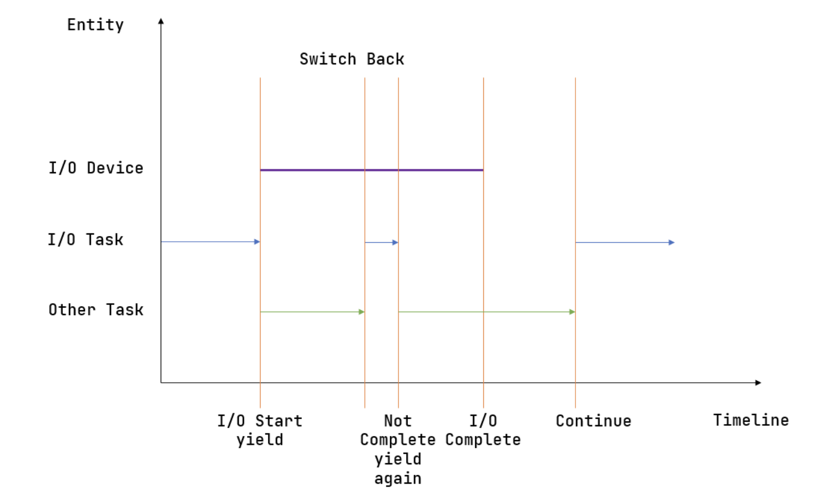
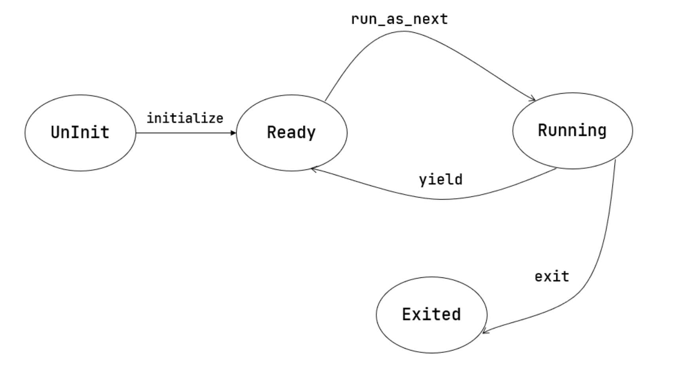

# 第三章
# 多道程序与分时多任务
## 回顾批处理系统
第二章实现了一个批处理操作系统，它能够自动按照顺序加载并运行序列中的每一个应用，当一个应用运行结束之后无需操作员的手动替换；另一方面，在硬件级特权隔离机制的帮助下，运行在更高特权级的操作系统不会受到有意或者无意出错的应用的影响；在硬件异常触发机制的帮助下，可以全方位监控运行在用户态低特权级的应用执行，一旦应用越过了特权级界限或主动申请获得操作系统的服务，就会触发 Trap 并进入到批处理系统中进行处理。无论原因是应用出错或是应用声明自己执行完毕，批处理系统都只需要加载应用序列中的下一个应用并让其执行。可以看到批处理系统的特性是：在内存中同一时间最多只需驻留一个应用。这是因为只有当一个应用出错或退出之后，批处理系统才会去将另一个应用加载到相同的一块内存区域。

而计算机硬件在快速发展，内存容量在逐渐增大，处理器的速度也在增加，外设 I/O 性能方面的进展不大。这就使得以往内存只能放下一个程序的情况得到很大改善，但处理器的空闲程度加大了。于是科学家就开始考虑在内存中尽量同时驻留多个应用，这样处理器的利用率就会提高。但只有一个程序执行完毕后或主动放弃执行，处理器才能执行另外一个程序。我们把这种运行方式称为 **多道程序（Multiprogramming）** 。

## 协作式操作系统
当处理器进一步发展后，它与 I/O 的速度差距也进一步拉大。在 多道程序 运行方式下，一个程序如果不让出处理器，其他程序是无法执行的。如果一个应用由于 I/O 操作让处理器空闲下来或让处理器忙等，那其他需要处理器资源进行计算的应用还是没法使用空闲的处理器资源。于是就想到，让应用在执行 I/O 操作或空闲时，可以主动 释放处理器 ，让其他应用继续执行。当然执行 放弃处理器 的操作算是一种对处理器资源的直接管理，所以应用程序可以发出这样的系统调用，让操作系统来具体完成。这样的操作系统就是支持 多道程序 或 协作式多任务 的协作式操作系统。
## 抢占式操作系统
应用程序员在编写程序时，无法做到在程序的合适位置放置 放弃处理器的系统调用请求 ，这样系统的整体利用率还是无法提高。

所以，站在系统的层面，还是需要有一种办法能强制打断应用程序的执行，来提高整个系统的效率，让在整个系统中执行的多个程序之间占用计算机资源的情况相对公平一些。根据计算机系统的硬件设计，为提高 I/O 效率，外设可以通过硬件中断机制来与处理机进行 I/O 交互操作。这种硬件中断机制可随时打断应用程序的执行，并让操作系统来完成对外设的 I/O 响应。

而操作系统可进一步利用某种以固定时长为时间间隔的外设中断（比如时钟中断）来强制打断一个程序的执行，这样一个程序只能运行一段时间（可以简称为一个时间片, Time Slice）就一定会让出处理器，且操作系统可以在处理外设的 I/O 响应后，让不同应用程序分时占用处理器执行，并可通过统计程序占用处理器的总执行时间，来评估运行的程序对处理器资源的消耗。我们把这种运行方式称为 分时共享（Time Sharing） 或 抢占式多任务（Multitasking） ，也可合并在一起称为**分时多任务** 。  
我们可以把一个程序的一次完整执行过程称为一次 任务 (Task)，把一个程序在一个时间片（Time Slice）上占用处理器执行的过程称为一个 任务片 (Task Slice)。操作系统对不同程序的执行过程中的 任务片 进行调度和管理，即通过平衡各个程序在整个时间段上的任务片数量，就能达到一定程度的系统公平和高效的系统效率。在一个包含多个时间片的时间段上，会有属于不同程序的多个任务片在轮流占用处理器执行，这样的操作系统就是支持 分时多任务 或 抢占式多任务 的抢占式操作系统。

## 多道程序加载
上一章中讲解的加载方法是让所有应用都共享同一个固定的加载物理地址。也是因为这个原因，内存中同时最多只能驻留一个应用，当它运行完毕或者出错退出的时候由操作系统的 batch 子模块加载一个新的应用来替换掉它。本章中，所有的应用在内核初始化的时候就一并被加载到内存中。为了避免覆盖，它们自然需要被加载到不同的物理地址。
## “任务”概念的形成
我们把应用程序的一次执行过程（也是一段控制流）称为一个 **任务** ，把应用执行过程中的一个时间片段上的执行片段或空闲片段称为 “ 计算任务片 ” 或“ 空闲任务片 ” 。当应用程序的所有任务片都完成后，应用程序的一次任务也就完成了。从一个程序的任务切换到另外一个程序的任务称为 任务切换 。为了确保切换后的任务能够正确继续执行，操作系统需要支持让任务的执行“暂停”和“继续”。   
一旦一条控制流需要支持“暂停-继续”，就需要提供一种控制流切换的机制，而且需要保证程序执行的控制流被切换出去之前和切换回来之后，能够继续正确执行。这需要让程序执行的状态（也称上下文），即在执行过程中同步变化的资源（如寄存器、栈等）保持不变，或者变化在它的预期之内。不是所有的资源都需要被保存，事实上只有那些对于程序接下来的正确执行仍然有用，且在它被切换出去的时候有被覆盖风险的那些资源才有被保存的价值。这些需要保存与恢复的资源被称为 **任务上下文 (Task Context)** 。
## 任务切换的设计与实现
本节所讲的任务切换是第二章提及的 Trap 控制流切换之外的另一种异常控制流，都是描述两条控制流之间的切换，如果将它和 Trap 切换进行比较，会有如下异同：

* 与 Trap 切换不同，它不涉及特权级切换；  

* 与 Trap 切换不同，它的一部分是由编译器帮忙完成的；

* 与 Trap 切换相同，它对应用是透明的。

我们将任务切换封装为函数 
> _switch
##  多道程序与协作式调度
本节的一个重点是展示进一步增强的操作系统管理能力的和对处理器资源的相对高效利用。为此，对 任务 的概念进行进一步扩展和延伸：形成了

* 任务运行状态：任务从开始到结束执行过程中所处的不同运行状态：未初始化、准备执行、正在执行、已退出

* 任务控制块：管理程序的执行过程的任务上下文，控制程序的执行与暂停

* 任务相关系统调用：应用程序和操作系统之间的接口，用于程序主动暂停 sys_yield 和主动退出 sys_exit

我们暂时考虑 CPU 只能单向地通过读取外设提供的寄存器信息来获取外设处理 I/O 的完成状态。多道程序的思想在于：内核同时管理多个应用。如果外设处理 I/O 的时间足够长，那我们可以先进行任务切换去执行其他应用；在某次切换回来之后，应用再次读取设备寄存器，发现 I/O 请求已经处理完毕了，那么就可以根据返回的 I/O 结果继续向下执行了。这样的话，只要同时存在的应用足够多，就能一定程度上隐藏 I/O 外设处理相对于 CPU 的延迟，保证 CPU 不必浪费时间在等待外设上，而是几乎一直在进行计算。这种任务切换，是让应用 主动 调用 sys_yield 系统调用来实现的，这意味着应用主动交出 CPU 的使用权给其他应用。

上图描述了一种多道程序执行的典型情况。其中横轴为时间线，纵轴为正在执行的实体。开始时，某个应用（蓝色）向外设提交了一个请求，随即可以看到对应的外设（紫色）开始工作。但是它要工作相当长的一段时间，因此应用（蓝色）不会去等待它结束而是会调用 sys_yield 主动交出 CPU 使用权来切换到另一个应用（绿色）。另一个应用（绿色）在执行了一段时间之后调用了 sys_yield ，此时内核决定让应用（蓝色）继续执行。它检查了一下外设的工作状态，发现请求尚未处理完，于是再次调用 sys_yield 。然后另一个应用（绿色）执行了一段时间之后 sys_yield 再次切换回这个应用（蓝色），这次的不同是它发现外设已经处理完请求了，于是它终于可以向下执行了。  
上面我们是通过“避免无谓的外设等待来提高 CPU 利用率”这一切入点来引入 sys_yield 。但其实调用 sys_yield 不一定与外设有关。随着内核功能的逐渐复杂，我们还会遇到其他需要等待的事件，我们都可以立即调用 sys_yield 来避免等待过程造成的浪费。

## 任务控制块与任务运行状态
在一段时间内，内核需要管理多个未完成的应用，而且我们不能对应用完成的顺序做任何假定，并不是先加入的应用就一定会先完成。这种情况下，我们必须在内核中对每个应用分别维护它的运行状态，目前有如下几种：
```
// os/src/task/task.rs

#[derive(Copy, Clone, PartialEq)]
pub enum TaskStatus {
    UnInit, // 未初始化
    Ready, // 准备运行
    Running, // 正在运行
    Exited, // 已退出
}
```
仅仅有这个是不够的，内核还需要保存一个应用的更多信息，我们将它们都保存在一个名为**任务控制块 (Task Control Block) (TCB)** 的数据结构中：
```
// os/src/task/task.rs

#[derive(Copy, Clone)]
pub struct TaskControlBlock {
    pub task_status: TaskStatus,
    pub task_cx: TaskContext,
}
```
可以看到我们还在 task_cx 字段中维护了上一小节中提到的任务上下文。任务控制块非常重要，它是内核管理应用的核心数据结构。在后面的章节我们还会不断向里面添加更多内容，从而实现内核对应用更全面的管理。

# 任务管理器
我们还需要一个全局的任务管理器来管理这些用任务控制块描述的应用：
```
// os/src/task/mod.rs

pub struct TaskManager {
    num_app: usize,
    inner: UPSafeCell<TaskManagerInner>,
}

struct TaskManagerInner {
    tasks: [TaskControlBlock; MAX_APP_NUM],
    current_task: usize,
}
```
其中仍然使用到了变量与常量分离的编程风格：字段 num_app 仍然表示任务管理器管理的应用的数目，它在 TaskManager 初始化之后就不会发生变化；而包裹在 TaskManagerInner 内的任务控制块数组 tasks 以及表示 CPU 正在执行的应用编号 current_task 会在执行应用的过程中发生变化：每个应用的运行状态都会发生变化，而 CPU 执行的应用也在不断切换。因此我们需要将 TaskManagerInner 包裹在 UPSafeCell 内以获取其内部可变性以及单核上安全的运行时借用检查能力。

再次强调，这里的 current_task 与第二章批处理系统中的含义不同。在批处理系统中，它除了表示 CPU 正在执行哪个应用外，表示一个既定的应用序列中的执行进度，可推测出在该应用之前的应用都已经执行完毕，之后的应用都没有执行；而在本章，我们只能通过它知道 CPU 正在执行哪个应用，而不能推测出其他应用的任何信息。

>此处是关于一些系统调用的实现，如sys_yield,run_next_task等等，可以在文档中阅读详细信息，对ch3对实现非常重要。  
........  
........

我们可以总结一下应用的运行状态变化图：


## 分时多任务系统与抢占式调度
我们可以将多道程序的调度机制分类成 协作式调度 (Cooperative Scheduling) ，因为它的特征是：只要一个应用不主动 yield 交出 CPU 使用权，它就会一直执行下去。与之相对， 抢占式调度 (Preemptive Scheduling) 则是应用 随时 都有被内核切换出去的可能。

现代的任务调度算法基本都是抢占式的，它要求每个应用只能连续执行一段时间，然后内核就会将它强制性切换出去。一般将 时间片 (Time Slice) 作为应用连续执行时长的度量单位，每个时间片可能在毫秒量级。调度算法需要考虑：每次在换出之前给一个应用多少时间片去执行，以及要换入哪个应用。可以从性能（主要是吞吐量和延迟两个指标）和 公平性 (Fairness) 两个维度来评价调度算法，后者要求多个应用分到的时间片占比不应差距过大。
## 时间片轮转调度
时间片轮转算法 (RR, Round-Robin)，本章中我们仅需要最原始的 RR 算法，用文字描述的话就是维护一个任务队列，每次从队头取出一个应用执行一个时间片，然后把它丢到队尾，再继续从队头取出一个应用，以此类推直到所有的应用执行完毕。  
时间片轮转调度的核心机制就在于计时。操作系统的计时功能是依靠硬件提供的时钟中断来实现的。

## RISC-V中的中断
在这里我们只需要了解：

* U 特权级的应用程序发出系统调用或产生错误异常都会跳转到 S 特权级的操作系统内核来处理；

* S 特权级的时钟/软件/外部中断产生后，都会跳转到 S 特权级的操作系统内核来处理。
## 时钟中断、计时器、抢占式调度
timer 子模块的 set_next_trigger 函数对 set_timer 进行了封装，它首先读取当前 mtime 的值，然后计算出 10ms 之内计数器的增量，再将 mtimecmp 设置为二者的和。这样，10ms 之后一个 S 特权级时钟中断就会被触发。  
timer 子模块的 get_time_us 以微秒为单位返回当前计数器的值，这让我们终于能对时间有一个具体概念了。  
有了时钟中断和计时器，抢占式调度就很容易实现了：
```
// os/src/trap/mod.rs

match scause.cause() {
    Trap::Interrupt(Interrupt::SupervisorTimer) => {
        set_next_trigger();
        suspend_current_and_run_next();
    }
}
```
我们只需在 trap_handler 函数下新增一个条件分支跳转，当发现触发了一个 S 特权级时钟中断的时候，首先重新设置一个 10ms 的计时器，然后调用上一小节提到的 suspend_current_and_run_next 函数暂停当前应用并切换到下一个。

为了避免 S 特权级时钟中断被屏蔽，我们需要在执行第一个应用之前进行一些初始化设置：
```
// os/src/main.rs

#[no_mangle]
pub fn rust_main() -> ! {
    clear_bss();
    println!("[kernel] Hello, world!");
    trap::init();
    loader::load_apps();
    trap::enable_timer_interrupt();
    timer::set_next_trigger();
    task::run_first_task();
    panic!("Unreachable in rust_main!");
}
// os/src/trap/mod.rs

use riscv::register::sie;

pub fn enable_timer_interrupt() {
    unsafe { sie::set_stimer(); }
}
```
第 9 行设置了 sie.stie 使得 S 特权级时钟中断不会被屏蔽；

第 10 行则是设置第一个 10ms 的计时器。

# 课后题
* 协作式调度与抢占式调度的区别是什么？

协作式调度中，进程主动放弃 (yield) 执行资源，暂停运行，将占用的资源让给其它进程；抢占式调度中，进程会被强制打断暂停，释放资源让给别的进程。

* 中断、异常和系统调用有何异同之处？

  * 相同点

        都会从通常的控制流中跳出，进入 trap handler 进行处理。

  * 不同点

        中断的来源是异步的外部事件，由外设、时钟、别的 hart 等外部来源，与 CPU 正在做什么没关系。

    异常是 CPU 正在执行的指令遇到问题无法正常进行而产生的。

    系统调用是程序有意想让操作系统帮忙执行一些操作，用专门的指令（如 ecall ）触发的。


* 如何判断进入操作系统内核的起因是由于中断还是异常？

    检查 mcause 寄存器的最高位，1 表示中断，0 表示异常。

    当然在 Rust 中也可以直接利用 riscv 库提供的接口判断：
```
let scause = scause::read();
    if scause.is_interrupt() {
        do_something
    }
    if scause.is_exception() {
        do_something
    }
```
又或者，可以按照 trap/mod.rs:trap_handler() 中的写法，用 match scause.cause() 来判断。

* 在 RISC-V 中断机制中，PLIC 和 CLINT 各起到了什么作用？

CLINT 处理时钟中断 (MTI) 和核间的软件中断 (MSI)；PLIC 处理外部来源的中断 (MEI)。

* 本章提出的任务的概念与前面提到的进程的概念之间有何区别与联系？

联系：任务和进程都有自己独立的栈、上下文信息，任务是进程的“原始版本”，在第五章会将目前的用户程序从任务升级为进程。

区别：任务之间没有地址空间隔离，实际上是能相互访问到的；进程之间有地址空间隔离，一个进程无法访问到另一个进程的地址。

* 任务控制块保存哪些内容？

在本章中，任务控制块即 os/src/task/task.rs:TaskControlBlock 保存任务目前的执行状态 task_status 和任务上下文 task_cx。

* 任务上下文切换需要保存与恢复哪些内容？

需要保存通用寄存器的值，PC；恢复的时候除了保存的内容以外还要恢复特权级到用户态。

* 特权级上下文和任务上下文有何异同？

    * 相同点：特权级上下文和任务上下文都保留了一组寄存器，都代表一个“执行流”

    * 不同点：

    特权级上下文切换可以发生在中断异常时，所以它不符合函数调用约定，需要保存所有通用寄存器。同时它又涉及特权级切换，所以还额外保留了一些 CSR，在切换时还会涉及更多的 CSR。

    任务上下文由内核手动触发，它包装在 os/src/task/switch.rs:__switch() 里，所以除了“返回函数与调用函数不同”之外，它符合函数调用约定，只需要保存通用寄存器中 callee 类型的寄存器。为了满足切换执行流时“返回函数与调用函数不同”的要求，它还额外保存 ra。

* 上下文切换为什么需要用汇编语言实现？

上下文切换过程中，需要我们直接控制所有的寄存器。C 和 Rust 编译器在编译代码的时候都会“自作主张”使用通用寄存器，以及我们不知道的情况下访问栈，这是我们需要避免的。

切换到内核的时候，保存好用户态状态之后，我们将栈指针指向内核栈，相当于构建好一个高级语言可以正常运行的环境，这时候就可以由高级语言接管了。

* 有哪些可能的时机导致任务切换？

系统调用（包括进程结束执行）、时钟中断。

* 在设计任务控制块时，为何采用分离的内核栈和用户栈，而不用一个栈？

用户程序可以任意修改栈指针，将其指向任意位置，而内核在运行的时候总希望在某一个合法的栈上，所以需要用分开的两个栈。

此外，利用后面的章节的知识可以保护内核和用户栈，让用户无法读写内核栈上的内容，保证安全。


