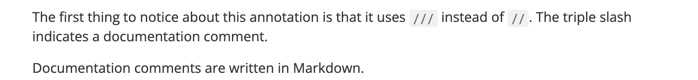
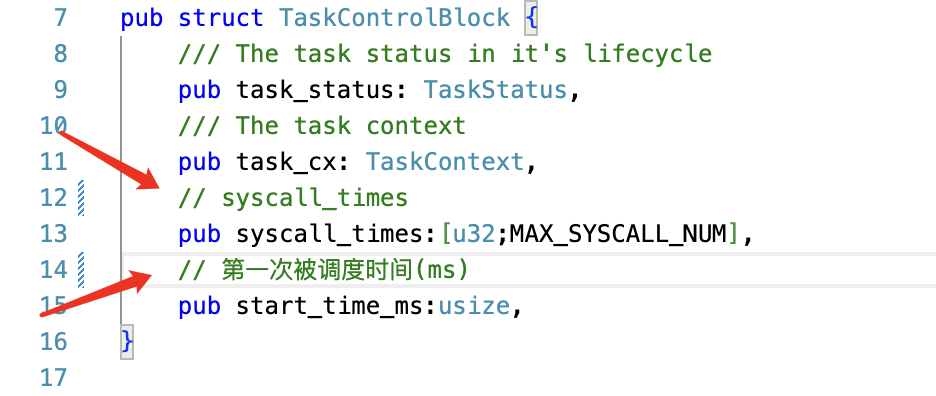
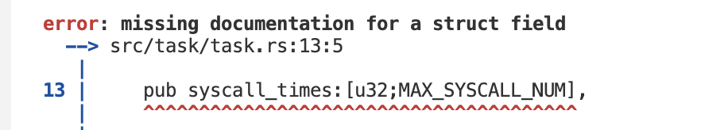

# Ch3
## 编程作业
本次练习是实现一个获取当前任务的信息的函数。
任务信息包括任务控制块相关信息（任务状态）、任务使用的系统调用及调用次数、系统调用时刻距离任务第一次被调度时刻的时长（单位ms）。  
在代码实现中只要去完善结构体，然后调用几个系统已经给出的接口就可以实现功能。  
难度很大一部分在对Rust的语法不是很熟悉...
比如⬇️




## 简答作业

好像有点难....挑点会做的做
1. 正确进入 U 态后，程序的特征还应有：使用 S 态特权指令，访问 S 态寄存器后会报错。 请同学们可以自行测试这些内容 (运行 Rust 三个 bad 测例 (ch2b_bad_*.rs) ， 注意在编译时至少需要指定 LOG=ERROR 才能观察到内核的报错信息) ， 描述程序出错行为，同时注意注明你使用的 sbi 及其版本。  
     
2. 深入理解 trap.S 中两个函数 __alltraps 和 __restore 的作用，并回答如下问题:

* 1、L40：刚进入 __restore 时，a0 代表了什么值。请指出 __restore 的两种使用情景。  
    a0代表cpu当前所处的特权级。  
    __restore两种使用情景为U到S的切换与S到U的切换  
* 2、L43-L48：这几行汇编代码特殊处理了哪些寄存器？这些寄存器的的值对于进入用户态有何意义？请分别解释。
```
ld t0, 32*8(sp)
ld t1, 33*8(sp)
ld t2, 2*8(sp)
csrw sstatus, t0
csrw sepc, t1
csrw sscratch, t2
```  
特殊处理了sstatus、sepc、sscratch  
sstatus指示cpu当前所处的特权级
sepc为 Trap 处理完成后默认会执行的下一条指令的地址
sscratch为中转寄存器,暂存内核栈地址,并以它作为基地址指针来依次保存 Trap 上下文的内容。


* 3、L50-L56：为何跳过了 x2 和 x4？
```
ld x1, 1*8(sp)
ld x3, 3*8(sp)
.set n, 5
.rept 27
   LOAD_GP %n
   .set n, n+1
.endr
```
x2不保存因为我们要基于它来找到每个寄存器应该被保存到的正确的位置。  
x4寄存器除非我们手动出于一些特殊用途使用它，否则一般也不会被用到。

* 4、L60：该指令之后，sp 和 sscratch 中的值分别有什么意义？
```
csrrw sp, sscratch, sp
```
sp 重新指向用户栈栈顶，sscratch 也依然保存进入 Trap 之前的状态并指向内核栈栈顶。

* 5、 __restore：中发生状态切换在哪一条指令？为何该指令执行之后会进入用户态？
  sret。指令本身属于高特权级的指令，表示从 S 模式返回到 U 模式。
* 6、L13：该指令之后，sp 和 sscratch 中的值分别有什么意义？
```
csrrw sp, sscratch, sp
```

sscratch指向用户栈栈顶，sp指向内核栈栈顶  
* 7、从 U 态进入 S 态是哪一条指令发生的？  
    call trap_handler

# 荣誉准则
1. 在完成本次实验的过程（含此前学习的过程）中，我曾分别与 以下各位 就（与本次实验相关的）以下方面做过交流，还在代码中对应的位置以注释形式记录了具体的交流对象及内容：

    《你交流的对象说明》

2. 此外，我也参考了 以下资料 ，还在代码中对应的位置以注释形式记录了具体的参考来源及内容：

    《你参考的资料说明》

3. 我独立完成了本次实验除以上方面之外的所有工作，包括代码与文档。 我清楚地知道，从以上方面获得的信息在一定程度上降低了实验难度，可能会影响起评分。

4. 我从未使用过他人的代码，不管是原封不动地复制，还是经过了某些等价转换。 我未曾也不会向他人（含此后各届同学）复制或公开我的实验代码，我有义务妥善保管好它们。 我提交至本实验的评测系统的代码，均无意于破坏或妨碍任何计算机系统的正常运转。 我清楚地知道，以上情况均为本课程纪律所禁止，若违反，对应的实验成绩将按“-100”分计。